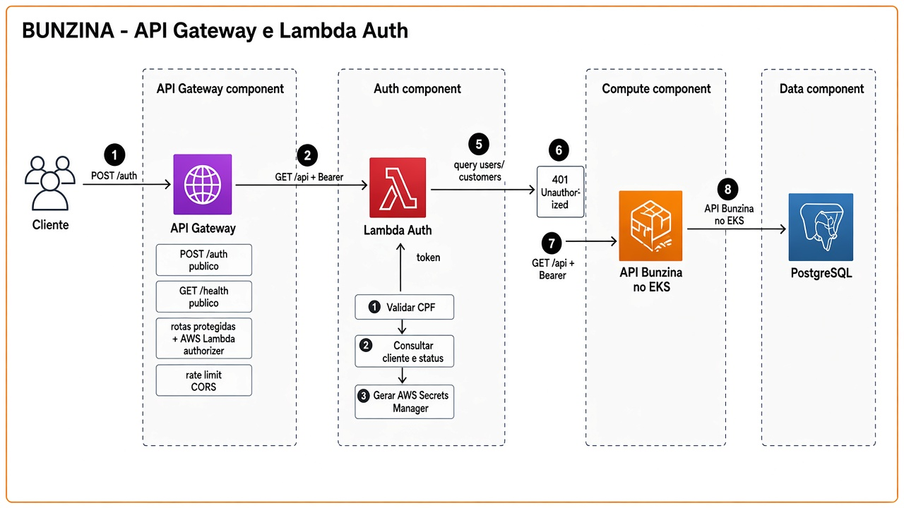

# API Gateway e Lambda

A Lambda executa as três etapas obrigatórias do PDF na mesma Function. O Gateway é a única porta pública.



## Responsabilidades

### API Gateway

- Roteia `/auth` para a Lambda e o restante para o EKS
- Valida o JWT **antes** da requisição chegar à API
- Aplica políticas (rate limit, CORS)
- Não conhece regras de negócio (RBAC por papel, estoque, máquina de estados)

### Lambda Auth

Uma Function, três etapas, serviços internos separados:

1. **Validar CPF** — dígitos verificadores e normalização (mesmo helper da API)
2. **Consultar cliente e status** — existe? `users.is_active`? há cliente associado?
3. **Emitir JWT** — `sub`, `email`, `role` e o documento do cliente

E-mail e senha continuam como credenciais. O CPF entra no mesmo request e precisa estar associado ao usuário.

## Contrato proposto de login

```http
POST /auth
Content-Type: application/json

{
  "document": "12345678909",
  "email": "cliente@bunzina.com",
  "password": "********"
}
```

```json
{ "token": "eyJhbGciOiJIUzI1NiIsInR5cCI6IkpXVCJ9..." }
```

| Situação | Resposta |
| --- | --- |
| CPF inválido | 400 |
| Cliente inexistente | 401 (mesma mensagem de credencial inválida) |
| Usuário inativo | 401 |
| Senha incorreta | 401 |
| Sucesso | 200 + JWT |

Detalhes em [RFC 0001](../rfcs/0001-auth-cpf-lambda-gateway.md).
