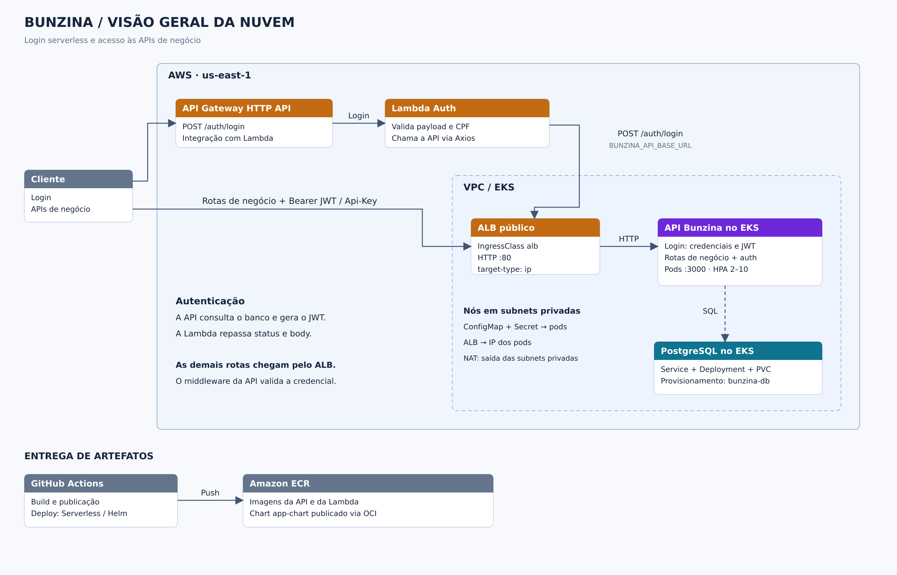

# Visão geral da nuvem

A arquitetura separa a entrada de login serverless do acesso às APIs de negócio.

Fonte editável: [cloud-overview.svg](../cloud-overview.svg).

## Quem chama quem

| Origem | Destino | Fluxo |
| --- | --- | --- |
| Cliente | API Gateway HTTP API | `POST /auth/login` |
| API Gateway | Lambda Auth | Encaminha a requisição de login |
| Lambda | API principal via ALB | Axios `POST /auth/login`, usando `BUNZINA_API_BASE_URL` |
| Cliente | ALB público | Rotas de negócio; credencial quando exigida |
| ALB | Pods da API | HTTP, com `target-type: ip` |
| API | PostgreSQL no EKS | Autenticação e persistência de negócio |
| GitHub Actions | ECR | Publicação de imagens e chart OCI |
| GitHub Actions | Lambda / Gateway / EKS | Deploy via Serverless e Helm |

A API consulta o usuário e gera o JWT. A Lambda valida o CPF e repassa a
resposta da API. A [sequência de autenticação](./sequence-auth.md) detalha o fluxo.

## Rede, banco e artefatos

Os nós EKS ficam em subnets privadas. O ALB recebe as requisições públicas;
o NAT atende à saída dos nós e pods. O [diagrama EKS](./eks.md) detalha a rede.

O PostgreSQL é provisionado no EKS pelo `bunzina-db`, com Deployment, Service e
PVC, conforme a [ADR-001](../../adrs/adr-001-postgresql-terraform.md). A API usa o
Service `postgres:5432`; o banco tem ciclo de vida separado do chart da aplicação.

A Lambda usa `BUNZINA_API_BASE_URL` para alcançar a API. Sua configuração
Serverless não declara associação a uma VPC. O ECR armazena imagens consumidas
pela Lambda e pelos nós EKS, além do chart OCI usado pelo Helm.

## Fontes

- Repositório `bunzina-infra`: `infra/vpc.tf` e `infra/eks.tf`.
- [Valores Helm](../../../charts/bunzina-chart/values.yaml)
- [Deploy da API](../../../.github/workflows/deploy-k8s.yml)
- Projeto `bunzina-lambda`: configuração Serverless, serviço Axios e workflow de deploy.
