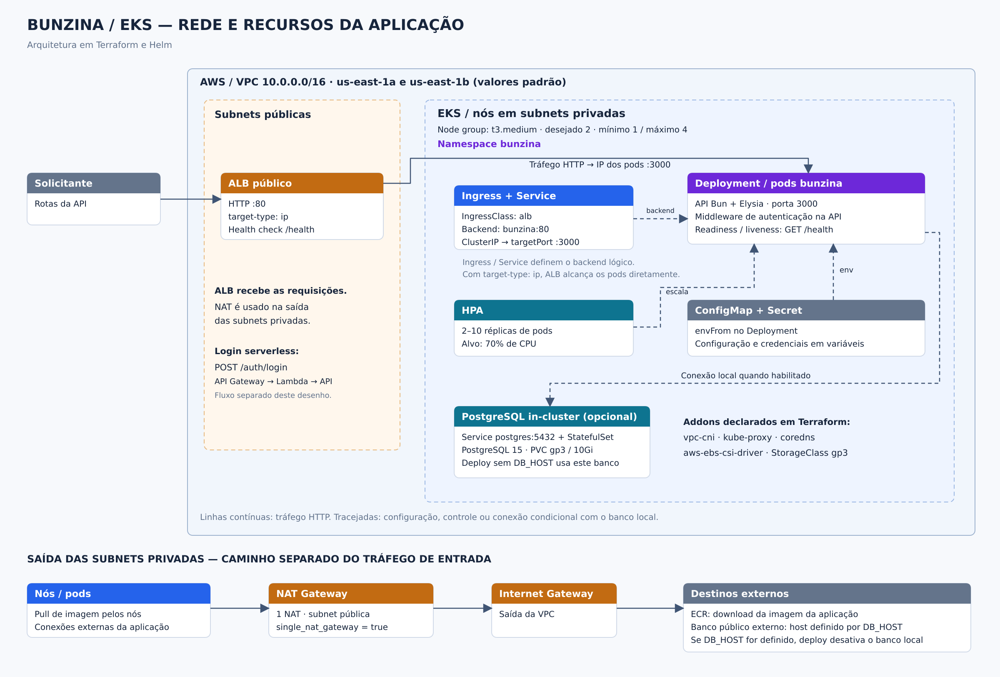

# Cluster EKS

O desenho representa a arquitetura declarada nos arquivos locais de Terraform,
Helm e deploy. Ele não é uma confirmação do estado atual da conta AWS.
As rotas da aplicação chegam ao ALB público; a autenticação é feita pela API.
O API Gateway declara somente `POST /auth/login` no projeto `bunzina-lambda`.



Fonte editável: [eks.svg](../eks.svg).

## Entrada e saída de rede

O chart configura um ALB `internet-facing`, listener HTTP `80`, health check
`/health` e `target-type: ip`. O Ingress aponta para o Service `bunzina:80`, cujo
targetPort é a porta HTTP `3000` dos pods. O Service define o backend lógico;
nesse modo, o tráfego do ALB vai diretamente aos IPs dos pods.
Esse comportamento está descrito na [documentação do ALB no EKS](https://docs.aws.amazon.com/eks/latest/userguide/alb-ingress.html).

O Terraform declara duas subnets públicas e duas privadas, um NAT Gateway e
nós nas subnets privadas. O NAT participa da saída para destinos públicos, pelo
Internet Gateway; não é um intermediário entre ALB e pods. Consulte a
[documentação de NAT Gateway](https://docs.aws.amazon.com/vpc/latest/userguide/vpc-nat-gateway.html).
O download de imagens do ECR é iniciado pelos nós; conexões da aplicação a um
banco público externo também usam a rota de saída. Um DB_HOST privado, com
roteamento privado próprio, não necessariamente usa NAT.

No desenho, linhas contínuas no painel superior representam tráfego HTTP;
as tracejadas representam configuração, controle e a conexão condicional com
o PostgreSQL local. O painel inferior detalha separadamente a rota de saída.

## Configuração declarada

| Recurso | Configuração |
| --- | --- |
| VPC / AZs | Padrão `10.0.0.0/16`, `us-east-1a` e `us-east-1b`; sobrescrevíveis por variáveis Terraform |
| Node group | `t3.medium`, desejado 2, mínimo 1 e máximo 4 nós por padrão |
| EKS API | Acesso público e privado habilitados; separado do endpoint HTTP da aplicação |
| Deployment | Imagem ECR; porta 3000; `USER bunzina` no Dockerfile |
| Réplicas | HPA habilitado, 2–10 pods, alvo de CPU 70%; o template omite `spec.replicas` quando o HPA está habilitado |
| Service | ClusterIP:80 → porta HTTP 3000 |
| Probes | Readiness e liveness em `/health` |
| ConfigMap / Secret | Injetados por `envFrom`; configurações de ambiente, banco e credenciais |
| Addons Terraform | `vpc-cni`, `kube-proxy`, `coredns`, `aws-ebs-csi-driver` |
| StorageClass | `gp3`, provisionador EBS CSI |

O AWS Load Balancer Controller e uma API de métricas compatível com o HPA são
requisitos operacionais. Os arquivos Terraform e o workflow de deploy
inspecionados não demonstram sua instalação; o desenho não os apresenta como
recursos cuja presença foi confirmada no cluster.

O deploy usa Helm com `--create-namespace`. Os templates do chart genérico
estão no projeto irmão `bunzina-chart`; o umbrella local referencia `app-chart`
versão `0.1.0` via OCI. A imagem publicada desse chart não foi inspecionada.

## Banco de dados: dois caminhos no deploy

| Condição no workflow | Comportamento |
| --- | --- |
| `DB_HOST` definido | Usa o host informado e desativa o PostgreSQL do chart com `app-chart.database.enabled=false` |
| `DB_HOST` vazio | Usa o Service `postgres`, porta padrão 5432, banco padrão `bunzina`, e mantém o PostgreSQL do chart habilitado |

O PostgreSQL do chart usa StatefulSet, imagem `postgres:15`, Service e PVC `gp3`
de `10Gi`. O `values.yaml` do umbrella contém um host externo como valor estático,
mas o workflow o sobrescreve nos dois casos acima. Por isso, apenas esse valor
não comprova qual banco está em uso. Não há recurso RDS declarado no Terraform
local; a imagem identifica o destino externo genericamente, sem presumir RDS.

## Fontes e geração

- [Rede Terraform](../../../infra/vpc.tf)
- [Cluster, nós e addons](../../../infra/eks.tf)
- [Variáveis Terraform](../../../infra/variables.tf)
- [Valores do umbrella](../../../charts/bunzina-chart/values.yaml)
- [Workflow de deploy](../../../.github/workflows/deploy-k8s.yml)
- Templates: projeto irmão `bunzina-chart/charts/app-chart/templates/`.

Em Linux/WSL com Python 3, librsvg, Cairo e GObject, execute na raiz do projeto:

```sh
python3 docs/arch/diagrams/generate_architecture.py
```
