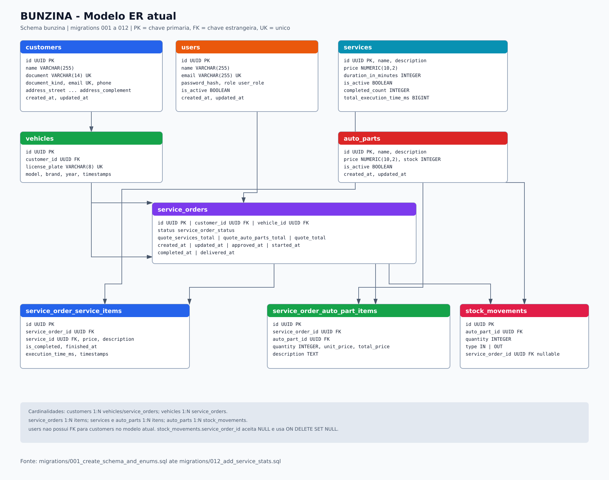
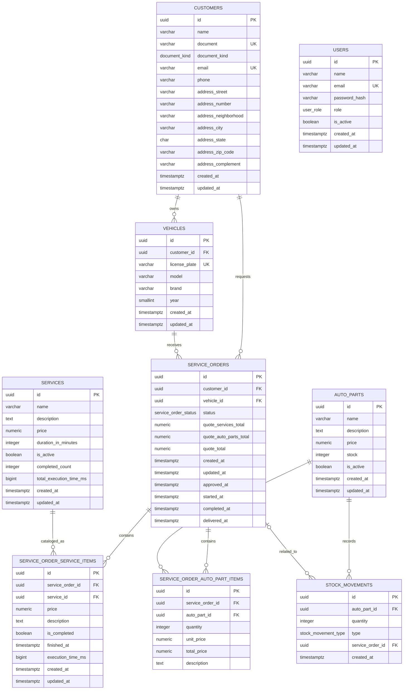

# Diagrama ER

Modelo atual do schema `bunzina`, baseado nas migrations `001` a `012`.
Fonte visual versionável: [er.svg](../er.svg).

`users` ainda não possui FK para `customers`. A associação prevista para o login
por CPF está descrita em [database.md](../database.md#evolucao-de-autenticacao)
e [RFC 0001](../rfcs/0001-auth-cpf-lambda-gateway.md), mas não faz parte do
modelo atual.

As setas não representam apenas navegação de API: elas refletem as FKs SQL e
suas regras de exclusão. Veículos e itens da OS usam cascade a partir do pai;
movimentações preservam o histórico da peça e desassociam a OS com `SET NULL`.
