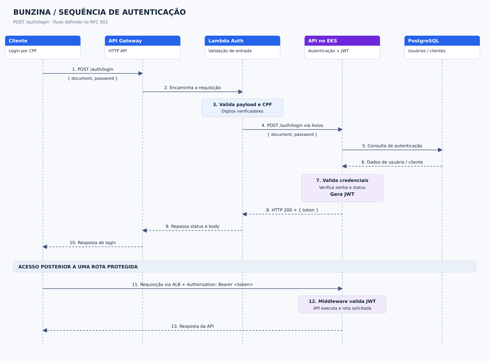

# Sequência — autenticação

O diagrama representa o fluxo definido no [RFC 001](../rfcs/0001-auth-cpf-lambda-gateway.md):
login por CPF, validação inicial na Lambda e autenticação com emissão de JWT na API.



Fonte editável: [sequence-auth.svg](../sequence-auth.svg).

## Fluxo definido

1. Cliente envia `POST /auth/login` com `{ document, password }` ao API Gateway.
2. Gateway encaminha a requisição para a Lambda.
3. Lambda valida o payload e os dígitos verificadores do CPF.
4. Lambda chama `POST /auth/login` da API via Axios, usando `BUNZINA_API_BASE_URL`.
5. API consulta os dados de autenticação no PostgreSQL, valida as credenciais e gera o JWT.
6. API devolve `{ token }`; Lambda repassa o status HTTP e o corpo da resposta ao Gateway, que responde ao cliente.
7. Para uma rota protegida, o cliente chama a API pelo ALB com Bearer JWT. O middleware da API valida a credencial.

A Lambda não consulta o PostgreSQL nem assina o JWT. O Gateway não participa das
rotas de negócio. As consultas ao banco estão agrupadas no desenho; o fluxo da
API até os pods via ALB está detalhado no [diagrama EKS](./eks.md).

## Divergência entre o contrato do RFC e o código local

O RFC descreve a aceitação de CPF pela API como implementada, mas a cópia local
inspecionada ainda define `email` e `password` em
[src/adapters/input/user/validations/login-schema.ts](../../../src/adapters/input/user/validations/login-schema.ts).
O [LoginUseCase](../../../src/application/use-cases/user/login.ts) busca por e-mail,
verifica `isActive`, valida a senha e assina o JWT.

Já `bunzina-lambda/src/adapters/input/validations/login-schema.ts` aceita
`document` e `password`, e `BunzinaAuthService` encaminha esses campos sem
conversão para e-mail. Assim, os contratos locais ainda não sustentam o fluxo de
sucesso por CPF mostrado no RFC e na imagem. Nenhum código de autenticação foi
alterado nesta revisão de documentação.

A Lambda retorna `400` para entrada inválida, repassa erros HTTP da API e retorna
`502` quando não obtém resposta do serviço de autenticação.

## Regeneração

Na raiz do projeto, em Linux/WSL com Python 3, librsvg, Cairo e GObject:

```sh
python3 -B docs/arch/diagrams/generate_auth_cloud.py
```
