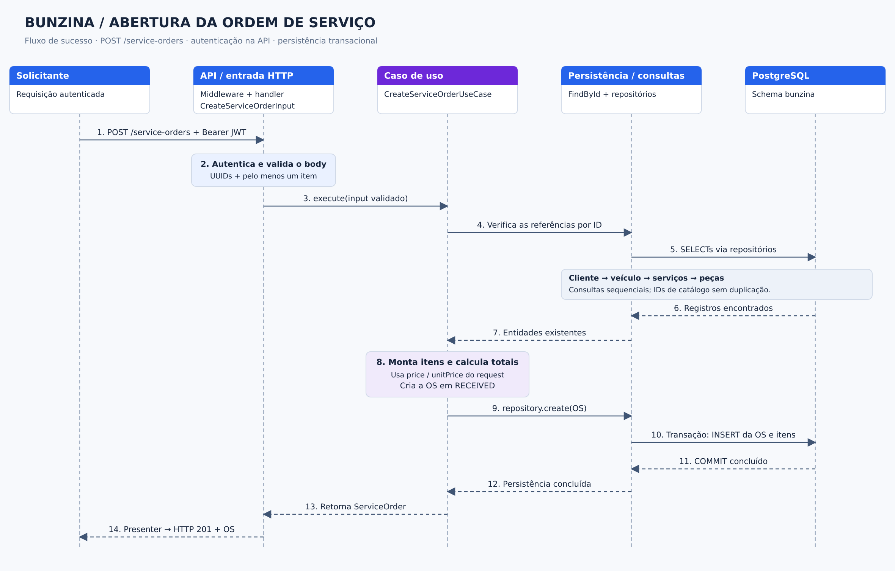

# Sequência — abertura da ordem de serviço

Fluxo de sucesso de `POST /service-orders`, conforme a implementação local.
A requisição chega à API pelo ALB; o middleware da API faz a autenticação.
API Gateway e Lambda expõem o login serverless e não participam desta rota.



Fonte editável: [sequence-service-order.svg](../sequence-service-order.svg).

## Fluxo implementado

1. A API recebe a requisição autenticada. O desenho exemplifica Bearer JWT; o middleware também aceita `Api-Key`.
2. A entrada valida `customerId`, `vehicleId` e os itens. É obrigatório informar pelo menos um serviço ou peça.
3. `CreateServiceOrderUseCase` verifica a existência do cliente e do veículo, nessa ordem, pelos respectivos casos de uso `FindById`.
4. Verifica os IDs distintos de serviços e depois de peças, por consultas sequenciais aos respectivos repositórios. As etapas de consulta estão agrupadas na imagem para legibilidade.
5. Monta os itens com `price` e `unitPrice` recebidos no request. Calcula o total de cada peça por quantidade, os subtotais e o orçamento; instancia a OS em `RECEIVED`.
6. `ServiceOrderRepository.create` executa uma transação com o INSERT de `service_orders` e os INSERTs dos itens informados em `service_order_service_items` e `service_order_auto_part_items`.
7. Após a persistência, a entrada usa `ServiceOrderPresenter.toHttp` e retorna HTTP `201` com a OS.

As verificações de existência acontecem antes da transação de escrita. O código
verifica cliente e veículo individualmente; não verifica nessa abertura que o
veículo pertence ao cliente informado. Os preços usados vêm do request, não de
uma substituição automática pelos preços do catálogo.

## Falhas e efeitos posteriores

- O middleware retorna `401` nos casos de credencial ausente ou inválida tratados por ele.
- A validação explícita do adapter retorna `400` quando o schema é inválido; o framework também valida o body na rota.
- Os casos de uso de consulta lançam `NotFoundError` quando uma referência não existe; a entrada usa `withErrorHandler` para tratá-lo.
- A abertura não altera estoque nem envia e-mail. Não há baixa de estoque no caso de uso de confirmação de orçamento inspecionado; portanto, ela não deve ser documentada como um efeito garantido da aprovação.
- O envio de orçamento por e-mail ocorre em `UpdateServiceOrderStatusUseCase` ao alcançar `AWAITING_APPROVAL`.

## Fontes

- [Rotas e middleware](../../../src/api/server.ts)
- [Autenticação](../../../src/api/middleware/auth.ts)
- [Entrada e resposta](../../../src/adapters/input/service-order/create.ts)
- [Schema de criação](../../../src/adapters/input/service-order/validations/create-service-order-schema.ts)
- [Caso de uso](../../../src/application/use-cases/service-order/create.ts)
- [Persistência](../../../src/infrastructure/repositories/service-order/service-order-repository.ts)

Para regenerar os PNGs e SVGs dos diagramas de sequência e EKS, execute na raiz
do projeto, em Linux/WSL com Python 3, librsvg, Cairo e GObject:

```sh
python3 docs/arch/diagrams/generate_architecture.py
```
