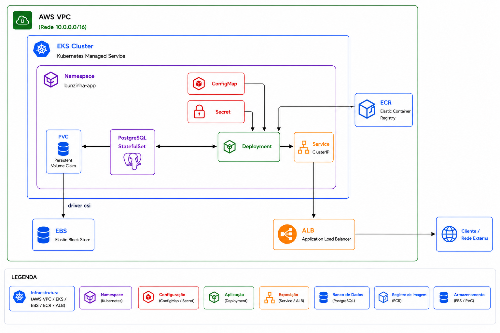

# Visão geral da arquitetura

O Bunzina é a API REST de uma oficina mecânica. A aplicação segue Clean Architecture (domínio sem dependência de frameworks), roda em **Bun + Elysia** e persiste dados em **PostgreSQL**.

Esta página descreve o que já existe e o desenho-alvo da Fase 3. Os diagramas detalhados estão em [diagrams/](./diagrams/README.md).

---

## Estado atual (Fases 1 e 2)

Hoje o tráfego chega direto ao cluster Kubernetes. A autenticação e as regras de negócio ficam na própria API.



### Componentes atuais

| Componente | Onde vive | Função |
| --- | --- | --- |
| API Elysia | Deployment no EKS | CRUD, workflow de OS, JWT e autorização |
| PostgreSQL | StatefulSet no cluster **ou** host externo (`DB_HOST`) | Persistência relacional no schema `bunzina` |
| Helm umbrella | `charts/bunzina-chart` + [bunzina-chart](https://github.com/Bunzina/bunzina-chart) | Deployment, Service, Ingress ALB, HPA, Secret, Postgres opcional |
| Terraform | `infra/` neste repositório | VPC, EKS, node group, addons, ECR |
| CI/CD | `.github/workflows/deploy-k8s.yml` | Testes, migrations, build, push ECR, `helm upgrade` |
| Notificação | Nodemailer | E-mail de orçamento ao avançar para `AWAITING_APPROVAL` |

### Autenticação atual

- Login: `POST /auth/login` com **e-mail e senha**
- JWT HS256 emitido pela própria API (`sub`, `email`, `role`, `iat`, `exp`)
- Rotas protegidas validam `Authorization: Bearer` ou `Api-Key` no middleware
- CPF/CNPJ existe no cadastro de **cliente**, não no de **usuário**
- Cadastro público: `POST /users` apenas com role `CUSTOMER`

### Repositórios atuais

1. [bunzina](https://github.com/Bunzina/bunzina) — aplicação, migrations, Terraform do EKS
2. [bunzina-chart](https://github.com/Bunzina/bunzina-chart) — Helm Chart genérico (`app-chart`)

---

## Alvo da Fase 3

A Fase 3 exige porta de entrada (API Gateway), autenticação serverless com CPF, banco gerenciado e quatro repositórios com CI/CD.


| Mudança | Motivo |
| --- | --- |
| API Gateway na frente de tudo | Roteamento, validação de JWT e políticas antes dos serviços internos |
| Lambda de autenticação | Validar CPF, consultar cliente/status e emitir JWT numa única Function |
| Banco gerenciado | Requisitos da Fase 3; a API já aceita host externo via `DB_HOST` |
| Quatro repositórios | Separar Lambda, infra K8s, infra de banco e aplicação, cada um com CI/CD |

O desenho detalhado está nas RFCs [0001](./rfcs/0001-auth-cpf-lambda-gateway.md), [0002](./rfcs/0002-repository-split.md) e [0003](./rfcs/0003-managed-database.md).

---

## Camadas da aplicação

```
src/
  domain/            entidades, VOs, interfaces — sem dependência externa
  application/       casos de uso
  adapters/          input (HTTP → use case) e output (presenter)
  api/               Elysia, handlers, middleware JWT
  infrastructure/    repositórios bun:sql, JWT, e-mail, Postgres
```

Fluxo de dependência: `api` → `adapters` → `application` → `domain` ← `infrastructure`.

---

## Escalabilidade em vigor

| Recurso | Valor | Justificativa |
| --- | --- | --- |
| Node group EKS | `t3.medium`, min 1 / desired 2 / max 4 | Cabe no AWS Academy Learner Lab e aguenta HPA + Postgres |
| Réplicas da API | min 2 / max 10 | Evita SPOF e cobre pico de correção/demo |
| HPA | CPU 70% | Escala antes de saturar o limite de 500m |
| Requests/limits | 100m–500m CPU, 128–256Mi | Cabe em 2 nós `t3.medium` com folga para kube-system |
| IMDS hop-limit | 2 | Sem isso, EBS CSI e ALB controller entram em CrashLoop no Learner Lab |
| NAT | 1 gateway | Custo; duas AZs apenas para o ALB |

Detalhes em [ADR 0008](./adrs/0008-escalabilidade.md).
